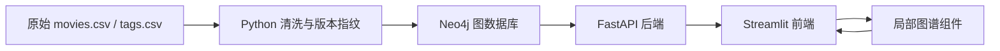
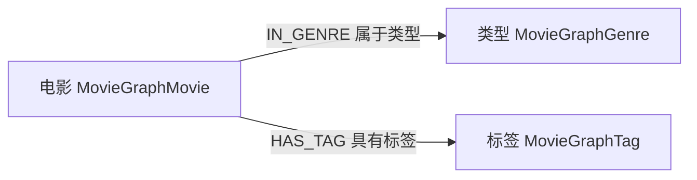

# 架构、图谱与接口

## 系统结构

电影对外由 `movieId` 唯一定位。内部 key 为数据版本 + movieId；类型、标签分别按版本 + name 唯一。各标签有唯一约束，不混用用户的其他数据库实体。`MovieGraphState` 记录当前生效数据集。版本只有在导入数量验证完成后生效，旧版本保留用于审计。

## 推荐定义

令 G(m)、T(m) 为电影 m 的去重类型、标签集合：

`score(m,n) = |G(m) ∩ G(n)| + |T(m) ∩ T(n)|`

排除自身和 0 分，按 score 降序、movieId 升序返回前 5。理由直接由交集构成。类型与标签即使同名也分别计数。未用标签频次加权、评分、余弦相似度或学习模型，不把分数解释为用户偏好概率。

## API

全部接口只读，部署在 http://127.0.0.1:18080 。OpenAPI `/docs` 可直接交互调试。

| 路径 | 参数 | 返回 |
|---|---|---|
| GET /health | 无 | status、database、dataset |
| GET /api/stats | 无 | 实体、关系、覆盖数量及类型分布 |
| GET /api/movies | q、offset≥0、limit 1–100 | items、total、offset、limit |
| GET /api/movies/{movieId} | 整数 ID | movieId、title、year、genres、tags |
| GET /api/movies/{movieId}/recommendations | limit 1–5 | items、rule |
| GET /api/movies/{movieId}/graph | limit 0–12 | nodes、edges、hiddenTags、movieId |
| GET /api/features/{kind} | genre/tag、name、offset、limit | 关联电影 items、total |

推荐每项含 movieId、title、year、score、sharedGenres、sharedTags、reason。图谱节点含 id、label、kind，电影节点还含 movieId；边含 source、target、relation。标签过多时图谱截断显示，完整信息仍保留在标签页和 API，相关电影最多 12 部。

空查询结果返回 HTTP 200 和空列表。不存在电影返回 404，越界参数返回 422，数据库未就绪返回 503。所有用户输入以 Cypher 参数传递，实体标签和关系名仅由程序固定映射选择，禁止拼接自由输入。

## 运行边界

前端仅通过 HTTP 调用后端，后端通过 Neo4j Bolt 驱动执行真实查询。自定义图谱组件完全本地加载，无外部 CDN。页面保留电影深链接和 JSON 下载。未实现管理员数据编辑、用户账号或收藏，因为这些不属于任务要求。

默认 Neo4j 关闭认证并仅监听 loopback，方便离线课堂演示。若改为远程服务，应启用认证、TLS 和网络限制。运行脚本不安装 Windows 服务、不永久改变 PATH 或系统 JAVA_HOME。

